# Changes to the AI Soc Website
## By Sergio Insuasti - Projects Subcommittee

### Task 1: About Section Update the main photo
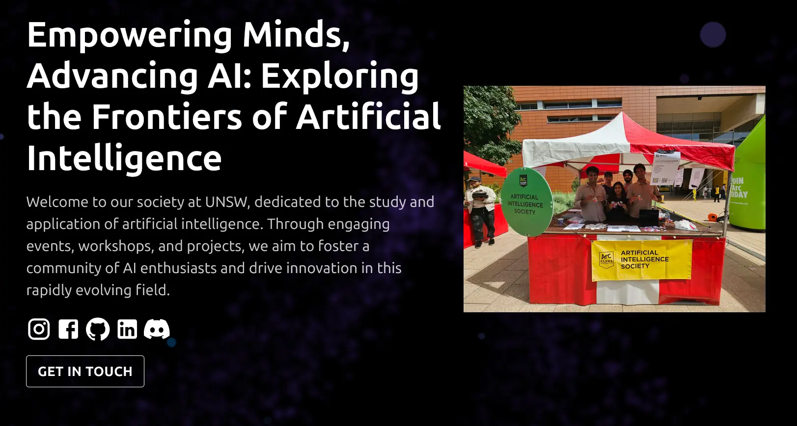

### Task 2: Reinventing Events Uploads
To create the admin section where each port can upload events, I used Firebase, which can easily handle authentication, image storage and metadata storage. If we are to continue with my changes, I'll organise the Firebase access such that it will no longer be me, but the AISoc projects email.

**Authentication**

For authentication, I made sure to include an accepted regex pattern, which would accept the gmail accounts of all current and future ports in AISoc, and no others. I have kept an empty list for regular email addresses to be added if any execs want exclusive access to the page (my email can be seen as an example). You can find this under the variable `allowedTestEmails` in `src/admin/AdminLogin.js`.

More importantly, this login page can only be accessed through the extension "/admin". Once this link is accessed, the user is taken away from the main page and will see this element.

*Colours and aesthetics for the following sections are open to suggestion and further edits.*

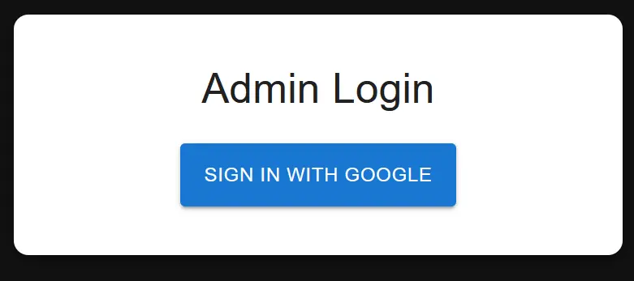

After the user chooses the correct email (AISoc gmail account), they will be taken to a Create Event form, which looks like this:
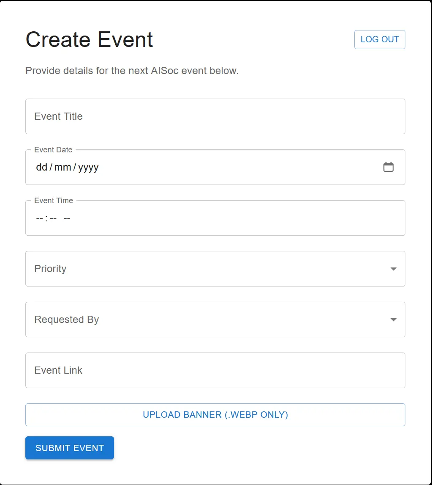
To submit an event, all fields must be filled in correctly along with attaching a webp image of the banner also. If the form cannot be completed, the user can log out and will return to the AISoc homepage. Restrictions and error checking have also been implemented to prevent dates in the past being created, accepting valid urls and checking complete fields. 

Take, for example, the upcoming AI Hackathon with Lovable, we would then complete the form as such:
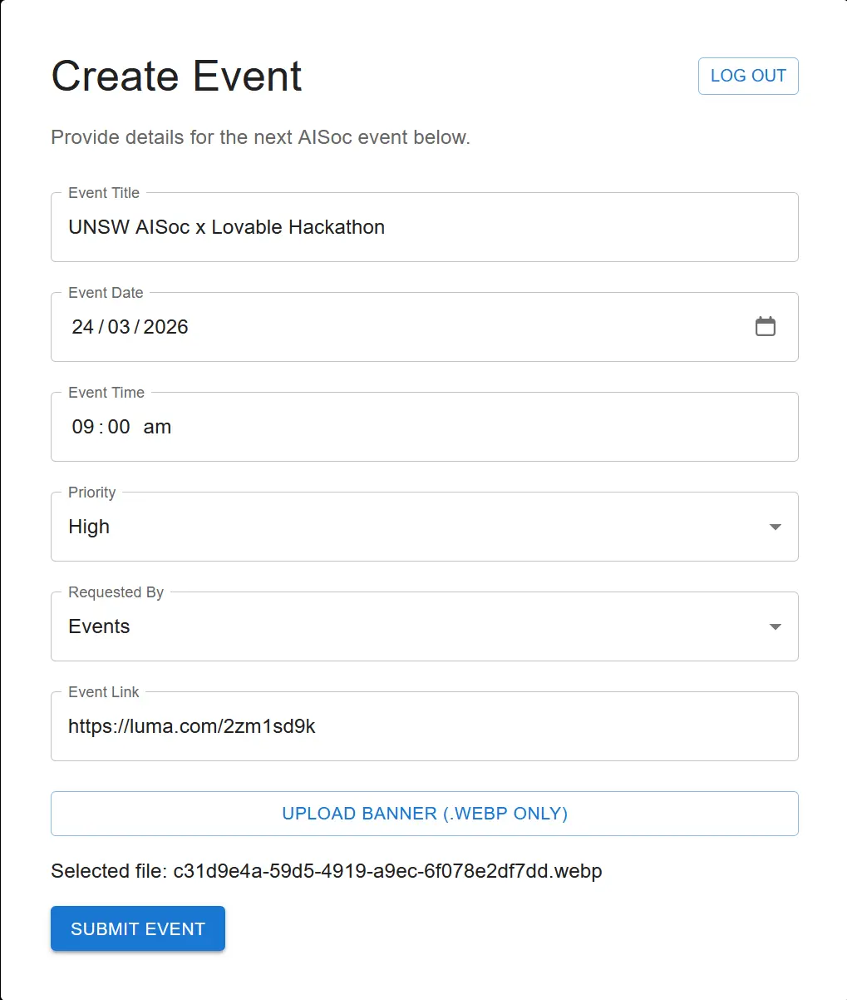

**Notification**

Once this form is sent, a number of events take place. First, a message is sent to a chosen Discord Server to alert the Projects team that a new event has been submitted. This ensures that the team is always notified of new changes to the website, and can act quickly if there is any required troubleshooting. For the case of demonstration, I used my own discord server, but this can easily be amended to a custom channel in our port's Discord.
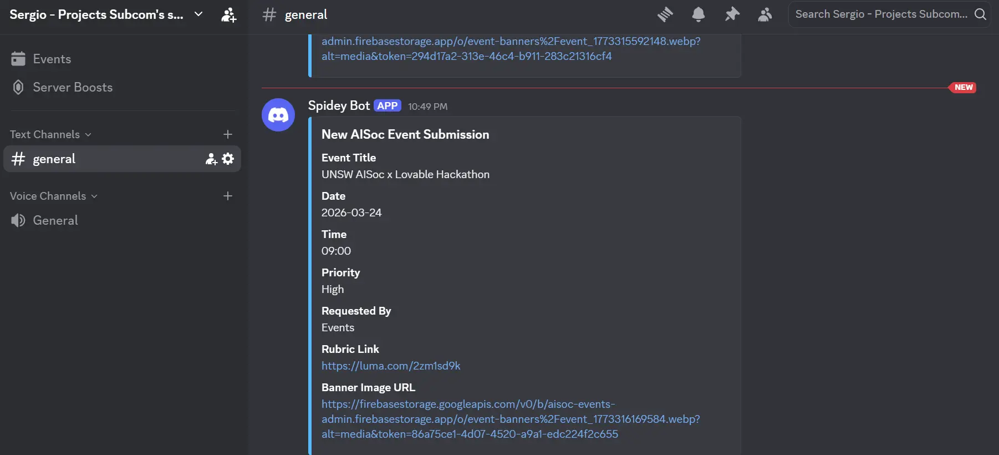

**Storage**

Then, the inputs of the form are split in two different sections, the event-banner image and the event's details. Firstly, the image is stored in Storage, a part of Firebase which allows us to use Bucket Storage. For easy recall and minimal conflict, the image is renamed to have the same unique id as the event's details. 
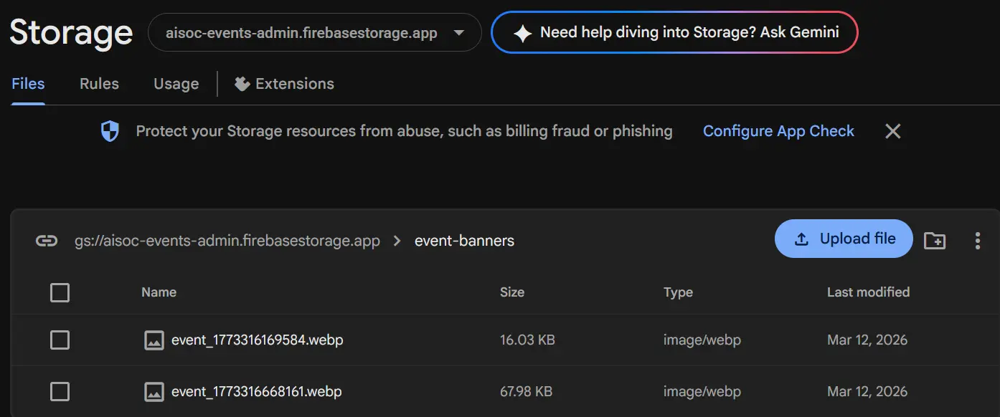
The event's details are then stored as metadata in a JSON object. This is then stored in Firebase's NoSQL database FireStore. Using the same unique id, we can easily recall the event's details to then be placed in each event element in the Events component.
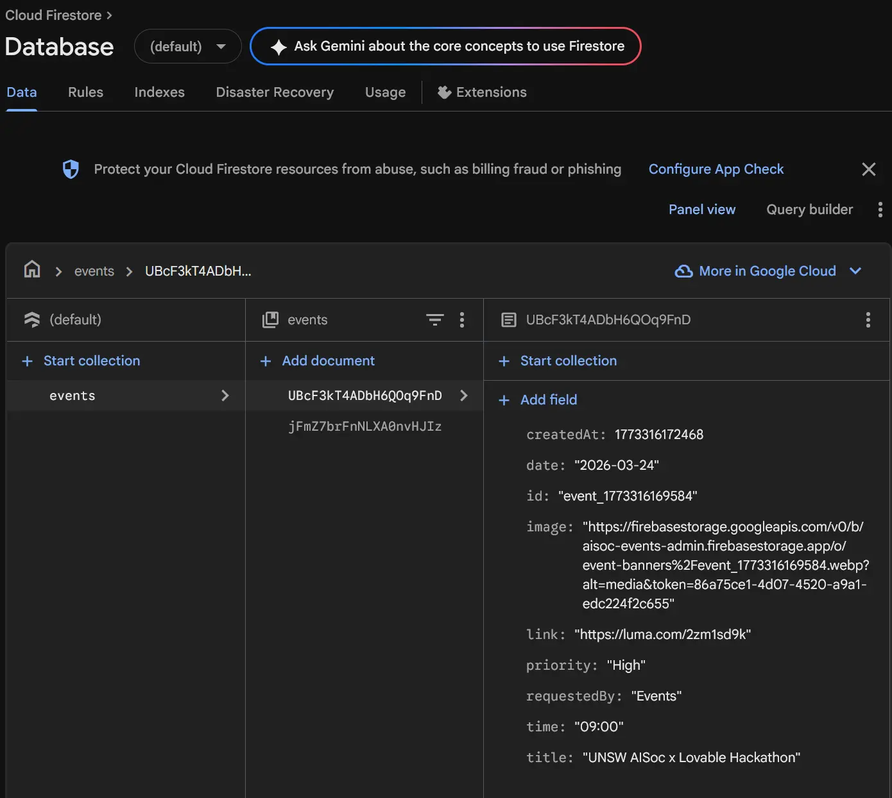

This new implementation has the Events component pulling from Firestore and Storage to present each new event as a new event banner.
With these tweaks, we now can automatically update the website through the Admin Dashboard! A video of the updated events section can be found in `Uploaded Events.mp4` (in same dir).

### Task 3: Update the Execs Photos
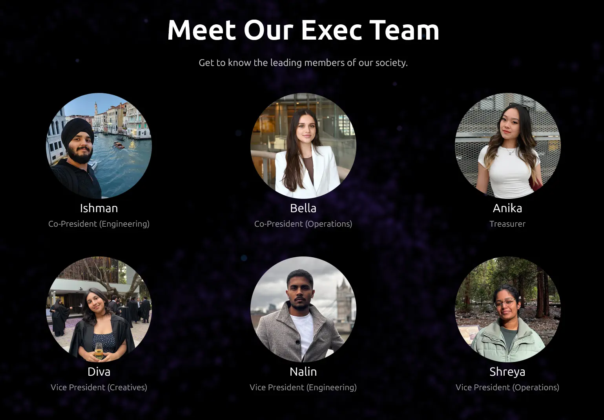
I am more than happy to rename the roles (Vice President to VP) but let me know.
If any other staff are needing to be added (VP for HR?) this is also easy to navigate.

### Task 4: Updated Newsletter
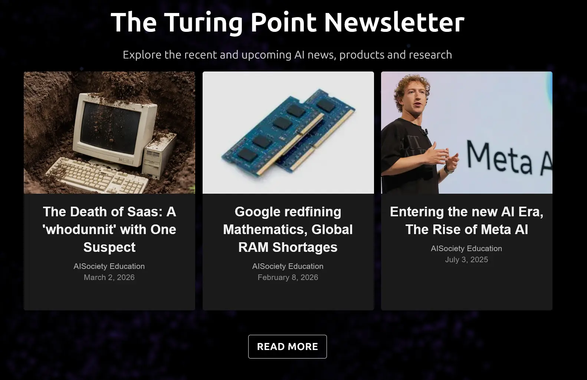
As requested, I updated the newsletter articles to show the latest posts. I made some titles for the most recent Turing Point posts, but I am very happy to have someone more experienced to change this. Same goes for the photos too!
Images are all formatted to be the same h-w ratio for uniformity, carousel animations kept.

### Task 5: FAQ Section
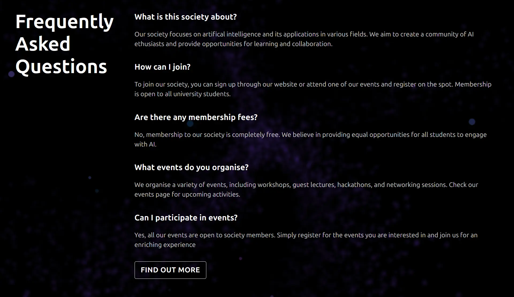
The plan for this section was to continue the reading momentum the rest of the website suggests. This involved moving the external link button to the bottom of the component. As requested, this links to the rubric page, but can be extended to link to a contact form if necessary.

### Task 6: Sponsor Section
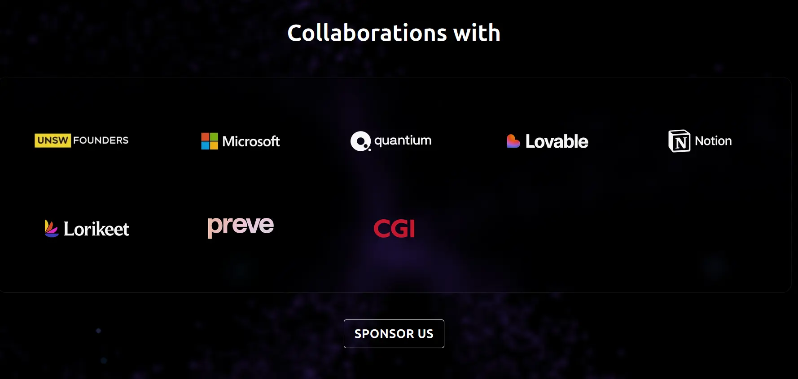
To suit the dark theme of the website, some external work was performed to create contrast-friendly logos. Other than that, the
arrangement of the logos was simple, and I also included some animation to the logos when the user scrolls to this section. I have kept the row size to 5 for the moment in case we land any extra collabs!
The video preview for this animation can be found in `Animated-Sponsors.mp4` in this directory.

### Task 7: Custom Element
Being candid, I really enjoy the single page which contains all the information regarding the society. So I made the decision not to create anything that takes visitors away from important information such as events.
So, for this section, I aimed to include more subtle features that help capitalise on the view time of each visitor, and helps capture their intentions quickly. This meant including interactive elements such as a photo stack in the about section to increase visitor retention and providing social media icons that are acceptable through the whole website to capture visitor interest immediately.

**Photo Stack**
For now, the photo stack contains only two photos but I feel that you will see the vision with other images. Media from recent events would have a great home in this section, providing an active and interactive snapshot of AISoc now!
For aesthetic I made it into polaroid frames and even included a permanent marker font which can describe each photo.
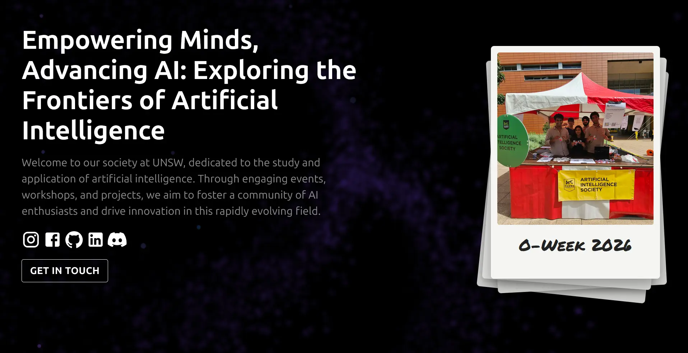
You can find a video of the stack in action on `Interactive Photo Stack.mp4` in this directory.

**Floating Social Media Icons**
While we can upkeep visitor retention on the website, we want them going to our socials the minute they are interested! With that in mind, I included a Floating Socials component, which follows the user down to the bottom of the page.
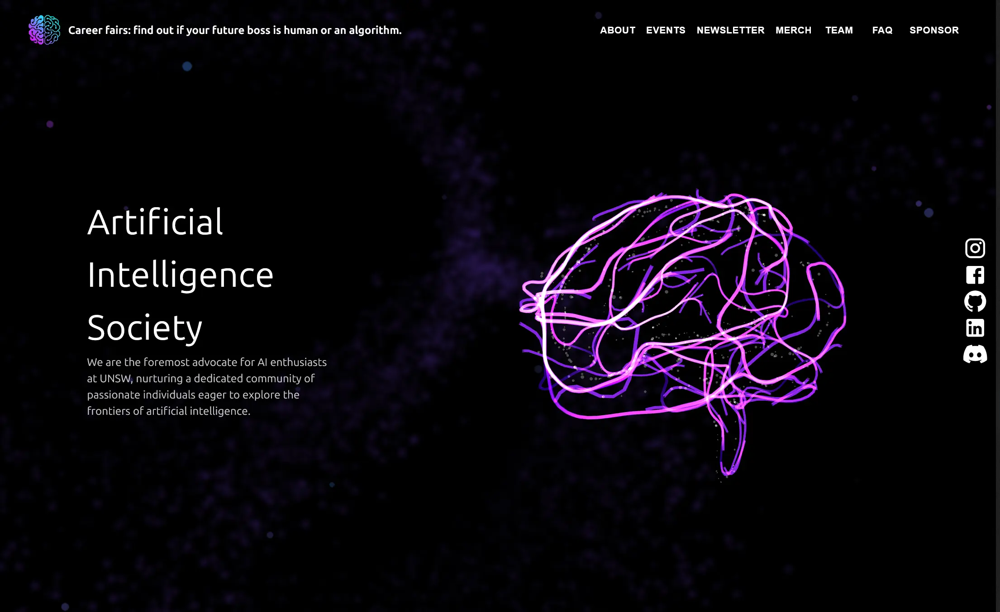
At the bottom of the page, the icons on the right disappear, and the original icons in the footer are instead shown.
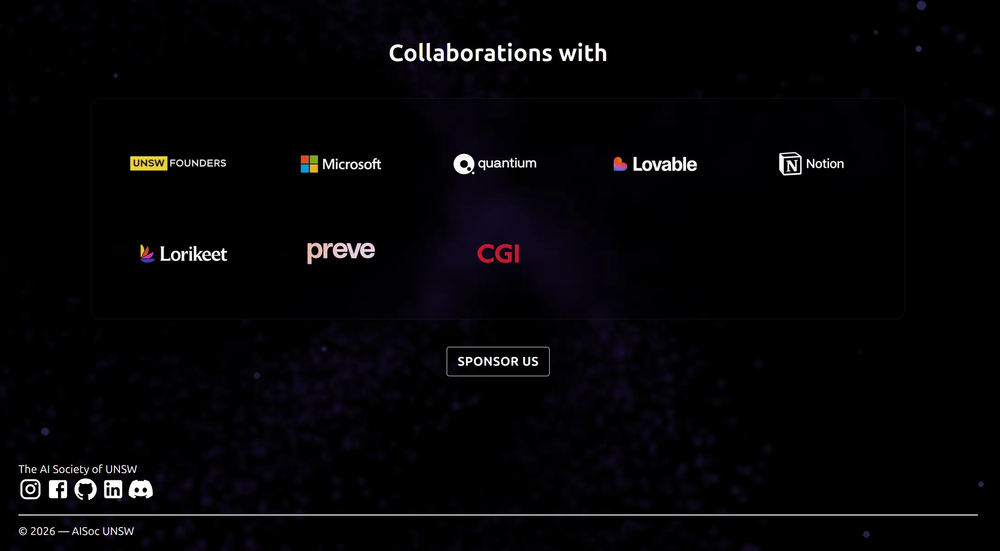

